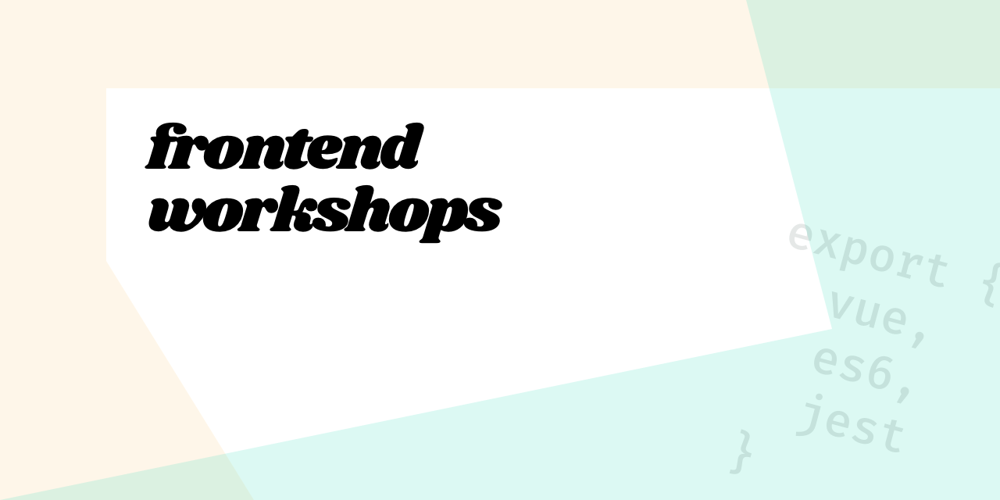

A collection of training notes and exercises covering a range of frontend topics.

---

## Topics covered

- **ES6 and beyond**
    *  Variable declaration
    *  Writing functions
    *  Rest and Spread syntax
    *  Classes
    *  Importing and exporting modules
- **Vue**
    *  Writing Vue components
    *  Documenting components
    *  Storing page-wide state in Vuex
- **Testing with Jest**
    *  for ordinary JS functions
    *  for Vue components
    *  for Vuex store modules

---

## Getting started

You will need:

*  A laptop with WIFI connection
*  A GitHub account
*  A CodeSandbox account

### Steps

1. Log into [CodeSandbox](https://codesandbox.io);
2. Click on **Create Sandbox**, then **Import Project**;
3. In the _GitHub Repository URL..._ field, paste the URL for this repo;
4. Click on **Generate Sandbox**;
5. After the Editor loads, click on **Fork** in the top right;
6. _(Optional)_ Rename your sandbox to something more memorable, by clicking on the generated title at the top.
